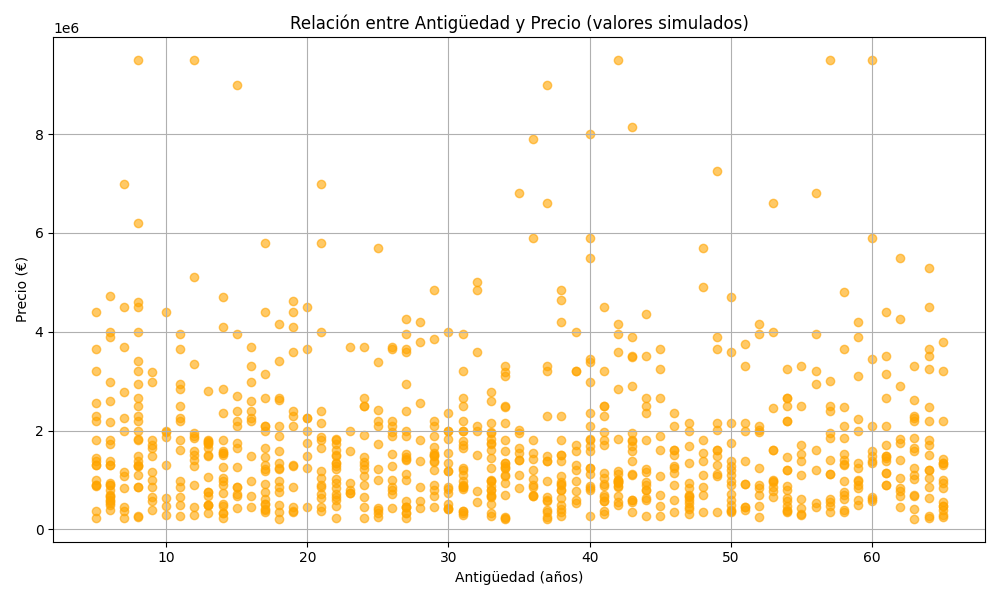

# 🏠 Proyecto Pisos - Análisis de Viviendas en Madrid

Este proyecto analiza datos de viviendas en venta en la Comunidad de Madrid. Incluye limpieza, modelado y análisis visual.

## 📊 Análisis: Precio vs Antigüedad

Este gráfico muestra la relación entre el precio y la antigüedad de los inmuebles (dato simulado para análisis exploratorio):

