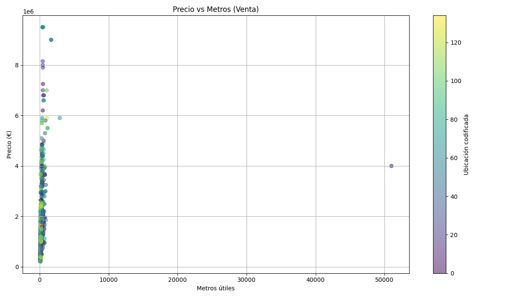
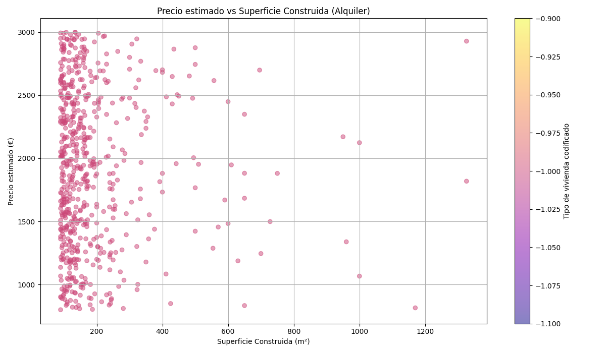

# 🏙️ Proyecto Pisos Madrid

Análisis, limpieza y visualización de datos de viviendas en venta y alquiler en la Comunidad de Madrid. Este proyecto procesa información desde fuentes en bruto (.json), limpia, modela y genera gráficos para extraer insights clave del mercado inmobiliario.

---

## 📁 Estructura del proyecto
## 🧹 Limpieza de datos

Los archivos `.json` iniciales fueron limpiados eliminando nulos, transformando strings numéricos, y normalizando nombres de columnas para facilitar su análisis posterior.

---

## 🧮 Modelado

Se generaron nuevos campos como:

- `id` (UUID único por fila)
- `timestamp` (fecha de carga)
- `antigüedad` (calculada aleatoriamente para visualización)

Los resultados se almacenan en archivos `.csv` y en SQLite para futuras consultas.

---

## 📊 Visualizaciones

### 💰 Precio vs Superficie (Venta)

---

### 🕰️ Precio vs Antigüedad (Venta)

---

### 🏢 Precio vs Superficie (Alquiler)

---

## 🔍 Consultas SQL

Consultas realizadas sobre bases de datos SQLite:

- Pisos con más de 3 habitaciones
- Pisos con más de 90m²
- Pisos por encima de 200.000€
- Alquileres con más de 90m²
- Alquileres tipo ático *(si existen)*

---
## Visualizaciones

### Precio vs Antigüedad

### Superficie Construida vs Precio (coloreado por ubicación)

### Superficie Construida vs Precio (simple)

## 🚀 Próximos pasos

- Integración en dashboard interactivo con Streamlit o Dash
- Mapas interactivos con `folium`
- Publicación de resultados

---

## 🧠 Autor

**Carla Gámez del Álamo**  
GitHub: [@carlagamezdelalamo](https://github.com/carlagamezdelalamo)

---
